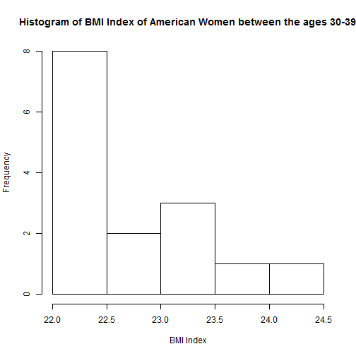

## Introduction

Health is of great concern to a large segment of the global population.
To enable self-awareness around healthy eating and exercise we have
developed the BMI Calculator.

--- 

## Summary of BMI Calculator
### Methodology
* Uses WHO standard category and BMI descriptions, range and calculations
* The calculator takes numeric inputs
* Output is both numeric and categorical

---

## Benefits
* Accepts the 2 major measuring systems, Metric and Imperial
* Categorical input instantly informs user of his/her health status
* Users are able, by playing around with the weight input, to identify their ideal weight

---

## Wrap Up
In conclusion, we know this tool, the BMI Calculator, will be indispensable in determening an individual's health status. This tool, combined with a healthy exercise regime and a good diet will enable the population to live healthier and fitter lives. 
